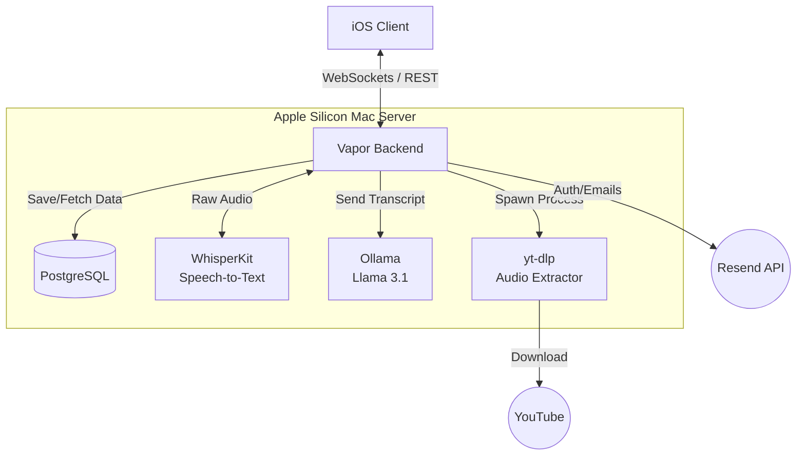
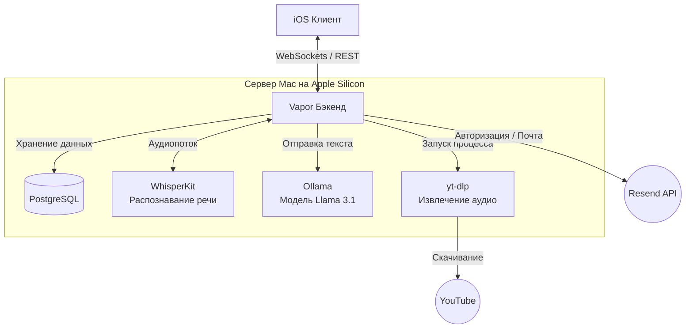

# Lector Backend Server


-lightgrey)

A high-performance, ML-powered server-side application built with Swift and Vapor. It provides the core inference infrastructure, secure data storage, real-time WebSocket communication, and AI summarization for the Lector ecosystem.

**iOS Client Repository:** [Lector-iOS](https://github.com/CozlovschiNichita/Lector-iOS)

---

## Table of Contents
- [English Version](#english-version)
  - [About the Project](#about-the-project)
  - [Key Features](#key-features)
  - [Prerequisites & Setup](#prerequisites--setup)
- [Project Structure](#project-structure)
- [Русская версия](#русская-версия)
  - [О проекте](#о-проекте)
  - [Ключевой функционал](#ключевой-функционал)
  - [Системные требования и Запуск](#системные-требования-и-запуск)
- [Структура проекта](#структура-проекта)

---

## English Version

### About the Project
The backend infrastructure of the Lector platform. The server ensures uninterrupted audio stream ingestion, ML model integration for speech-to-text, AI-driven summarization, and secure user data storage. The architecture is specifically optimized for **Apple Silicon (M-series)** to perform heavy asynchronous ML tasks natively without relying on external cloud APIs.

### Key Features
* **Real-time WebSockets:** Stream processing of audio chunks, featuring a custom buffer management system (context windowing) to reduce neural network hallucinations.
* **Native ML Inference (CoreML):** Integration with OpenAI Whisper (via WhisperKit) for on-premise, highly optimized speech recognition (Large v3 model) utilizing the Neural Engine.
* **AI Summarization:** Asynchronous integration with **Ollama** (Llama 3.1) to generate structured, multi-lingual lecture notes.
* **Actor-based Task Management:** A custom background task manager built with Swift Actors. It ensures heavy ML inference processes are immediately terminated if a client cancels a request, preventing CPU and memory leaks.
* **YouTube Pipeline:** Executes the yt-dlp binary natively to download and extract audio tracks directly on the server.
* **Security & Auth:** JWT-based authentication, secure password recovery via **Resend API**, and database operations secured by Fluent ORM with cascading references.

### System Architecture



---

### Prerequisites & Setup
**Note:** This server utilizes WhisperKit, which requires **macOS** (Apple Silicon strongly recommended) to compile and run CoreML models natively.

1. **Install System Dependencies:**
   ```bash
   brew install yt-dlp cloudflare/cloudflare/cloudflared
   ```
2. **Install & Run Ollama** (for AI summaries): 
   Download from ollama.com and run the following command to pull the model:
   ```bash
   ollama run llama3.1:8b-instruct-q8_0
   ```
3. **Initialize the Database:**
   ```bash
   docker-compose up -d
   ```
4. **Environment Configuration:**
   Rename `.env.example` to `.env` and fill in your JWT_SECRET, database credentials, and RESEND_API_KEY.
5. **Build and Run:**
   ```bash
   swift run App
   ```

---

## Project Structure
```text
Sources/LectorServer/
├── Controllers/       # API endpoints & HTTP request handling
├── DTOs/              # Data Transfer Objects (API Contracts)
├── Middleware/        # JWT Authentication guards
├── Migrations/        # PostgreSQL schema definitions
├── Models/            # Fluent ORM Database Models
└── Services/          # ML Actors, Queues, and core business logic
```

---

## Русская версия

### О проекте
Бэкенд-часть платформы Lector. Сервер обеспечивает бесперебойный прием аудиопотоков, интеграцию с моделями машинного обучения (Speech-to-Text и LLM), а также безопасное хранение пользовательских данных. Архитектура спроектирована специально под **Apple Silicon (M-series)** для нативного выполнения тяжелых задач искусственного интеллекта без зависимости от облачных API.

### Ключевой функционал
* **Real-time WebSockets:** Потоковая обработка фрагментов аудио, управление буферами (накопление и обрезка контекста) для минимизации галлюцинаций нейро сети.
* **Нативный ML Инференс (CoreML):** Интеграция с OpenAI Whisper (через WhisperKit) для локального распознавания речи (модель Large v3) на мощностях Neural Engine.
* **AI Конспекты:** Асинхронная интеграция с локальным сервером **Ollama** (модель Llama 3.1) для автоматической генерации структурированных конспектов на нескольких языках.
* **Task Management (Actor Model):** Собственный менеджер фоновых задач и очередей на базе Swift Actors. Гарантирует немедленную остановку вычислений при отмене задачи клиентом, предотвращая утечки памяти (OOM) и процессорного времени.
* **Обработка YouTube:** Использование системной утилиты yt-dlp для серверного скачивания и извлечения аудиодорожек.
* **Безопасность:** JWT-аутентификация, восстановление паролей через **Resend API** и строгая ссылочная целостность в PostgreSQL (каскадное удаление данных).

### Архитектура системы



---

### Системные требования и Запуск
**Внимание:** Сервер использует WhisperKit, поэтому для компиляции и работы CoreML моделей требуется **macOS** (настоятельно рекомендуется Apple Silicon).

1. **Установите системные зависимости:**
   ```bash
   brew install yt-dlp cloudflare/cloudflare/cloudflared
   ```
2. **Установите Ollama** (для генерации конспектов): 
   Скачайте дистрибутив с ollama.com и загрузите модель:
   ```bash
   ollama run llama3.1:8b-instruct-q8_0
   ```
3. **Запустите базу данных (через Docker Compose):**
   ```bash
   docker-compose up -d
   ```
4. **Настройка окружения:**
   Переименуйте файл `.env.example` в `.env` и укажите ваш JWT_SECRET, пароль от БД и RESEND_API_KEY.
5. **Сборка и запуск:**
   ```bash
   swift run App
   ```
*(Опционально) Для безопасного проброса локального порта в интернет используйте: `cloudflared tunnel run <your_tunnel_name>`*

---

## Структура проекта
```text
Sources/LectorServer/
├── Controllers/       # Эндпоинты API и обработка HTTP-запросов
├── DTOs/              # Объекты передачи данных (Контракты API)
├── Middleware/        # Защита маршрутов (JWT-аутентификация)
├── Migrations/        # Описание схем таблиц PostgreSQL
├── Models/            # Модели базы данных (Fluent ORM)
└── Services/          # ML-акторы, очереди и основная бизнес-логика
```

---

**Author:** [Nikita Kozlovskii](https://www.linkedin.com/in/nikitakozlovskii) | **Role:** `Full-Stack iOS Developer` | [](https://www.linkedin.com/in/nikitakozlovskii)
